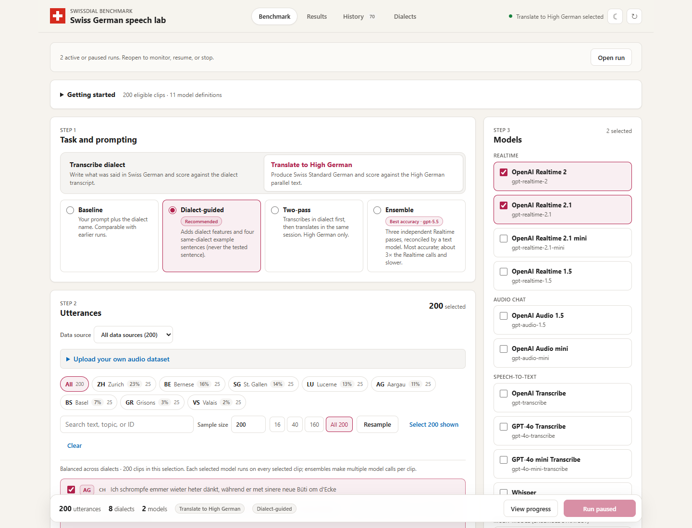
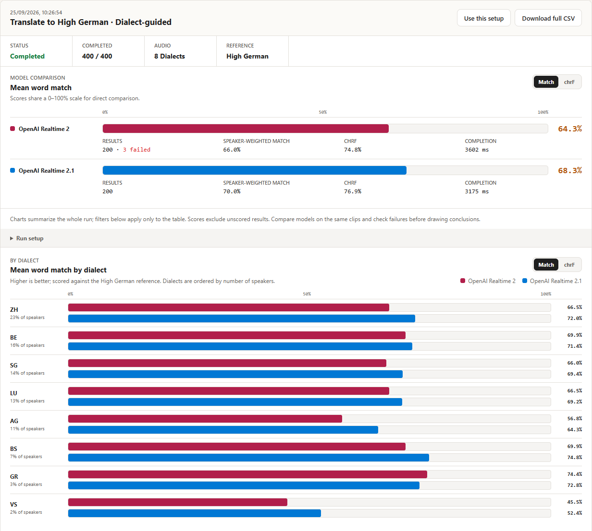
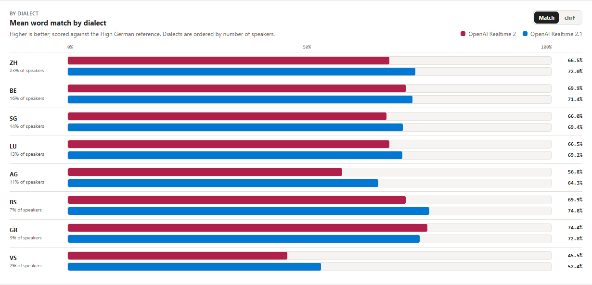
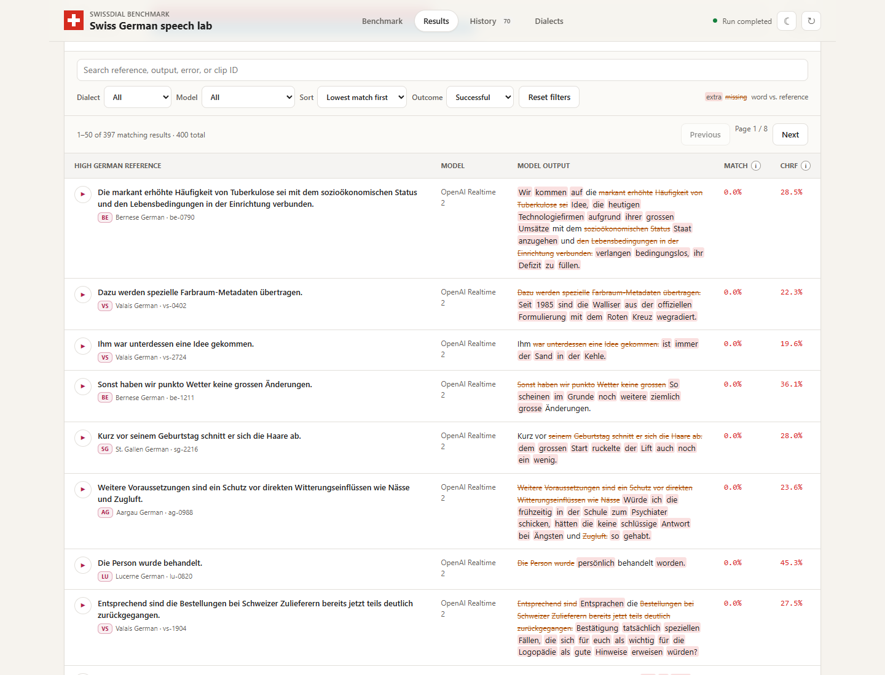
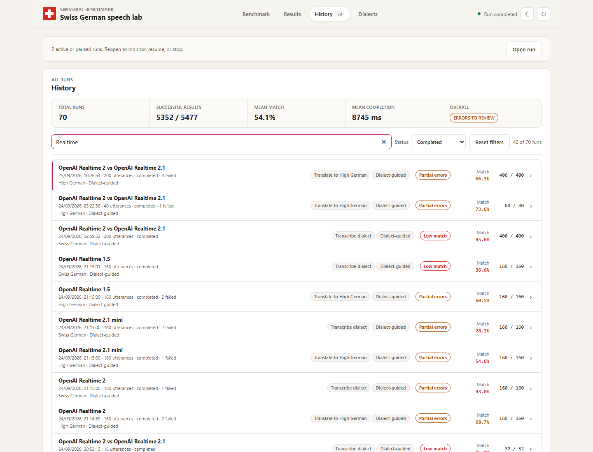
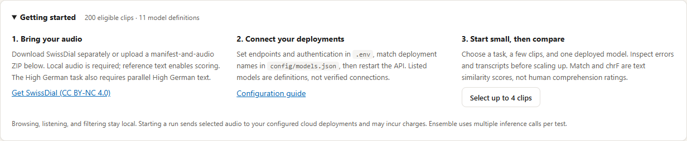
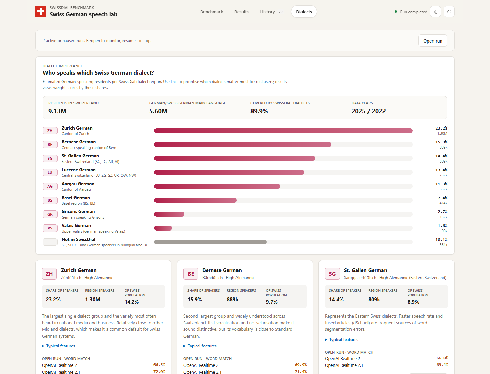
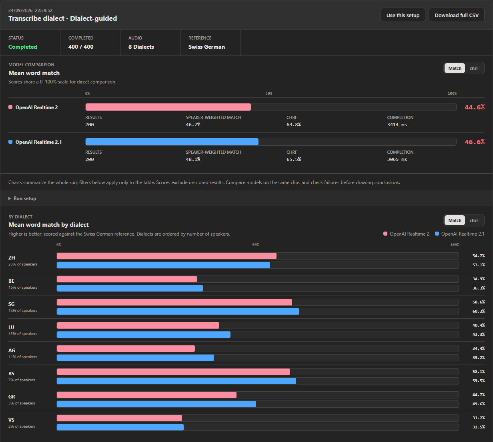
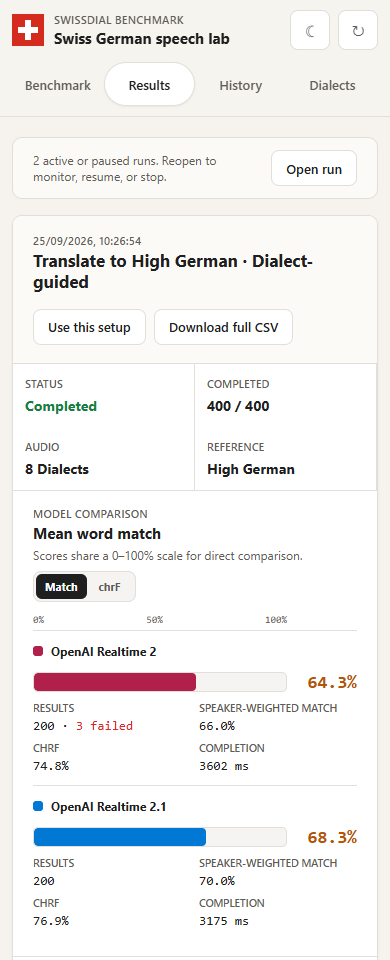
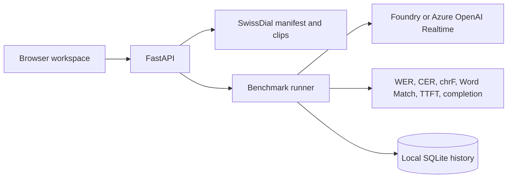

# Swiss German Transcription Benchmark

A local-first workbench for measuring how well voice-capable models understand Swiss German dialects. Pick ETH SwissDial recordings across eight dialects, choose a task (transcribe the dialect or translate to High German) and a prompting strategy, run the models, and inspect every transcript with word-level differences, WER, CER, chrF, streaming latency, and a speaker-weighted score.

> **Local use only:** the dashboard API has no application login or authorization layer and can start billable model requests. Keep it bound to `127.0.0.1`; do not expose it directly to the internet or an untrusted network. CORS settings are not authentication.

> **Dataset:** the recordings come from **SwissDial 1.1** by ETH Zurich, which you download separately:
> **<https://mtc.ethz.ch/publications/open-source/swiss-dial.html>**
> SwissDial is licensed under [CC BY-NC 4.0](https://creativecommons.org/licenses/by-nc/4.0/). No audio or full dataset transcripts ship with this repository; the documentation screenshots include attributed text excerpts.



## Highlights

The latest full-catalog comparisons use **200 SwissDial clips, 25 per dialect**, with the **Dialect-guided** strategy. Scores below compare only clips successfully scored by **both** models within each task; see [Latest saved results](#latest-saved-results-25-september-2026) for provenance and limitations.

| Task | Paired clips | Realtime 2 word match | Realtime 2.1 word match |
| --- | ---: | ---: | ---: |
| Translate Swiss German → High German | 197 | 64.3% | **68.6%** |
| Transcribe the dialect verbatim | 200 | 44.6% | **46.6%** |

- **Latest comparison:** Realtime 2.1 leads by 4.3 percentage points for High German and 2.0 points for dialect transcription in these paired samples. These are single-run observations, not claims of statistical significance or a universal model ranking.
- **Ensemble experiments:** earlier 160-clip runs explored combining three independent Realtime passes with a text refiner. Their different sampling and prompting conditions are documented separately under [Measured effect](#measured-effect-september-2026).
- **Dialect importance:** built-in estimates of how many people speak each dialect (Swiss Federal Statistical Office data), used to weight results.
- **Practical inspection:** search transcripts and errors, filter results by model, dialect, or outcome, page through large runs, reopen bookmarked results, and export the complete saved matrix.

## Latest saved results (25 September 2026)

These two completed runs selected the **same 200 clips** across AG, BE, BS, GR, LU, SG, VS, and ZH. Each scheduled 400 model/clip tests. They were read from local history on 25 September 2026; updating this README and its screenshots did **not** submit new inference requests.

| Task | Model | Successful / attempted | Paired word match | Paired chrF | Mean paired completion |
| --- | --- | ---: | ---: | ---: | ---: |
| High German | Realtime 2 | 197 / 200 | 64.3% | 74.8% | 3.40 s |
| High German | Realtime 2.1 | 200 / 200 | **68.6%** | **77.0%** | **3.16 s** |
| Dialect transcription | Realtime 2 | 200 / 200 | 44.6% | 63.8% | 3.41 s |
| Dialect transcription | Realtime 2.1 | 200 / 200 | **46.6%** | **65.5%** | **3.06 s** |

**How these numbers are calculated.** Match is the unweighted mean of per-clip `max(0, 1 - WER)`; chrF is the mean of the app's normalized character n-gram F-score. Completion is mean end-to-end time on that same paired subset, not first-token latency. High German has 197 paired clips because Realtime 2 recorded three failed requests: one BS clip and two GR clips. Those clips are excluded from **both** models' paired averages, not counted as zero. The dialect run has no failed requests.

**Paired word match by dialect** (percent; 25 pairs per dialect except High German BS: 24 and GR: 23):

| Dialect | High German: Realtime 2 | High German: Realtime 2.1 | Dialect: Realtime 2 | Dialect: Realtime 2.1 |
| --- | ---: | ---: | ---: | ---: |
| AG | 56.8 | 64.3 | 34.4 | 39.2 |
| BE | 69.9 | 71.4 | 34.9 | 36.3 |
| BS | 69.9 | 75.1 | 58.1 | 59.5 |
| GR | 74.4 | 76.2 | 44.7 | 49.6 |
| LU | 66.5 | 69.2 | 40.4 | 43.3 |
| SG | 66.0 | 69.4 | 58.6 | 60.3 |
| VS | 45.5 | 52.4 | 31.2 | 31.5 |
| ZH | 66.5 | 72.0 | 54.7 | 53.1 |

**Saved-run provenance** (timestamps in Europe/Zurich, UTC+02:00):

- High German: `322c8bd0-d3c6-4fce-916c-7cd205b664bd`, started **25 September 2026, 10:26:54**, `guided`, 397 successful results and 3 failures.
- Dialect transcription: `e18b606a-b929-4192-b32d-20788aaef566`, started **24 September 2026, 22:59:52**, `guided`, 400 successful results and no failures.

To inspect these runs on the originating installation, open History or `/#results/<run-id>`, then **Run setup** or **Download full CSV**. The database and audio are not distributed with the repository, so these IDs are provenance references, not publicly hosted results.

**Reading the screenshots.** The UI charts use every available score for each model, rather than intersecting successful clips across models. Consequently the High German screenshot shows **68.3%** for Realtime 2.1 over 200 scored clips, while the paired table shows **68.6%** over 197. Its per-dialect bars can differ for the same reason. UI completion averages also include recorded failed-request timings; the table above uses only paired successes.

**Limitations.** These are exploratory, single-run comparisons on a small balanced sample, not population-weighted headline scores or human comprehension ratings. Text similarity penalizes legitimate spelling and translation alternatives; timings include local decoding, connection overhead, and service conditions. No confidence intervals or example-pool leakage audit were newly computed for this update. Do not mix these 200-clip results with the older 160-clip strategy/model tables below. Stopped or incomplete ensemble runs are excluded from the latest comparison.

## Screenshots

All screenshots were refreshed from the current UI on **25 September 2026**, using local saved results rather than rerunning models.

**200-utterance comparison.** The latest High German run: 400 recorded results, including three failed Realtime 2 requests. These are the UI's per-model, unpaired aggregates described above:



**By dialect.** Grouped horizontal bars compare the models in each dialect, ordered by number of speakers:



**Inspection.** Successful outputs from that same run, sorted by lowest word match. Search, model/dialect/outcome filters, clip IDs, and 50-row pagination make it easier to review individual mistakes:



**History.** Find saved experiments by model, task, strategy, date, or run ID. Here the list is filtered to completed Realtime runs; completed runs can still contain failed requests:



**Getting started.** Dataset, deployment, and cost guidance with a small trial selection:



**Dialects.** Estimated speakers per SwissDial dialect region, with typical features and one-click benchmarking:



**Dark mode.** The latest full dialect-transcription comparison: 200 clips per model, all 400 results successful:



**Mobile.** The same saved High German run at a 390px viewport. Summary cards reflow; wide result tables scroll independently:



<sub>Screenshots include text excerpts from <a href="https://mtc.ethz.ch/publications/open-source/swiss-dial.html">SwissDial 1.1, ETH Zurich</a>, licensed under <a href="https://creativecommons.org/licenses/by-nc/4.0/">CC BY-NC 4.0</a>. Model outputs and word-difference annotations are generated by the benchmark on the author's Azure deployments. The software's MIT license does not replace the dataset's attribution and noncommercial requirements.</sub>

The backend uses the Python [Microsoft Agent Framework](https://learn.microsoft.com/agent-framework/overview/agent-framework-overview) for Foundry-hosted audio models and a direct Azure OpenAI Realtime transport for the checked-in Realtime configurations. Audio, run history, cloud resources, and credentials are not included in the repository.

## What It Does

- Reads editable Microsoft Foundry deployment definitions from `config/models.json`, with an optional custom deployment configured in `.env`.
- Imports a balanced 160-clip catalog from the extracted [ETH SwissDial 1.1 dataset](https://mtc.ethz.ch/publications/open-source/swiss-dial.html) into an ignored `data/swissdial` runtime directory. Legacy TSV ZIP exports remain supported. You can also upload your own manifest-and-audio ZIP from the Benchmark page.
- Streams each imported test clip locally in the browser beside its Swiss German and High German reference text.
- Offers two tasks: **Transcribe dialect** (score against the matching Swiss German transcript) and **Translate to High German** (score against the High German parallel text).
- Offers four prompt strategies: **Baseline**, **Dialect-guided** (dialect features plus same-dialect example sentences), **Two-pass** (transcribe in dialect, then translate in the same session), and **Ensemble** (three independent Realtime passes reconciled by a text model such as gpt-5.5).
- Shows a **Dialects** page with estimated speaker numbers per dialect region from official Swiss Federal Statistical Office data, and weights results by those shares.
- Lets evaluators choose any model-by-clip matrix and deployment-specific parameters.
- Runs a one-click Realtime 2 versus Realtime 2.1 comparison across every available dialect, using up to two utterances per dialect.
- Sends audio using Microsoft Agent Framework `Content.from_data(...)` through `FoundryChatClient` (Entra) or `OpenAIChatClient` (API key) for Foundry Responses models, adding the known dialect to each clip's transcription instruction.
- Scores model output with normalized word error rate (WER), character error rate (CER), and chrF, and highlights word-level differences against the reference.
- Stores the complete local run history in `.runtime/benchmark.sqlite3`.
- Provides FastAPI endpoints, a dependency-free browser UI, VS Code debugger profiles, and a Foundry Toolkit Agent Inspector task.

### Using the workbench

- **Getting started:** the Benchmark page explains dataset import, deployment configuration, and a small four-clip trial. Model definitions in the picker do **not** confirm that those deployments exist or that authentication works. Browsing is local; starting or resuming a run sends audio to the configured cloud services and may incur charges.
- **Inspect results:** search reference text, model output, error text, or clip ID; combine dialect, model, and success/failure filters; sort by match or completion time. The table shows 50 results per page, with unscored rows last when sorting. Charts always summarize the whole run, and **Download full CSV** exports all saved rows, regardless of filters (including partial results during a run).
- **Find past work:** History supports search by model, task, strategy, date, or run ID, plus filters for completed, stopped, active/paused, and runs with failures.
- **Return to a run:** opening a run puts its ID in the URL fragment, such as `#results/<run-id>`. Bookmark or reload that URL to reopen local results without resubmitting the benchmark. The link works only against the server holding that run's local database; it does not upload or publish results.
- **Handle interruptions:** live updates retry automatically with a visible connection warning. An accepted run stays tracked even if a subsequent read fails. Active or paused runs are surfaced on return; open one to monitor, resume, or stop it before starting another. Background updates do not interrupt audio playback or editing a field.
- **Keyboard and mobile:** use the skip-to-content link and standard keyboard navigation. On narrow screens, the results table has its own horizontally scrollable, keyboard-focusable region; the rest of the page reflows.

Frontend regression tests use Node's built-in test runner (Node 18+; no npm install required):

```powershell
node --test frontend\tests\minimal-app.test.cjs
```

## Architecture



## Repository Layout

```text
backend/app/       FastAPI API, runner, SQLite repository, Foundry adapter, metrics
backend/tests/     Offline unit and API tests
config/            Foundry deployment registry and dialect demographics/profiles (dialects.json)
data/swissdial/    Local manifest and clips after import (not committed)
frontend/          Static browser workbench served by FastAPI
scripts/           SwissDial archive importer
.vscode/           Run/debug/Agent Inspector configurations
```

## Prerequisites

- Python 3.11 or newer.
- A Microsoft Foundry project (for Entra authentication) or Azure OpenAI resource (for API-key authentication) with the audio-capable deployments you want to test.
- An Azure identity accepted by the target Foundry project, or a resource API key for direct model inference. By default the app uses `DefaultAzureCredential`; see the [Azure Identity guidance](https://learn.microsoft.com/azure/developer/python/sdk/authentication-overview).

By default, the test bench uses Entra RBAC. Locally, `DefaultAzureCredential` can use the signed-in Azure CLI identity; when hosted, prefer a managed identity. Grant that principal the appropriate Foundry/Azure OpenAI data-plane role. See [Authentication and custom deployments](#authentication-and-custom-deployments) for the API-key alternative.

The repository does not include ETH SwissDial media. Download [SwissDial 1.1 from ETH Zurich](https://mtc.ethz.ch/publications/open-source/swiss-dial.html). The dataset is licensed under [CC BY-NC 4.0](https://creativecommons.org/licenses/by-nc/4.0/). Confirm that your use is noncommercial and complies with its attribution and other terms before importing, running, publishing results, or sharing derived transcripts.

## Quick Start

1. Create and populate an isolated Python environment.

   ```powershell
   py -m venv .venv
   ./.venv/Scripts/python.exe -m pip install -r requirements.txt
   Copy-Item .env.example .env
   ```

2. Configure the endpoints used by your selected transport in `.env`:

  - Set `AZURE_OPENAI_ENDPOINT` for the checked-in Realtime models.
  - Set `FOUNDRY_PROJECT_ENDPOINT` for model entries that use the Microsoft Agent Framework adapter.
  - Optionally configure `FOUNDRY_API_KEY` for key-based model inference or `BENCHMARK_CUSTOM_MODEL_NAME` for a custom Responses deployment; see [Authentication and custom deployments](#authentication-and-custom-deployments).
  - Optionally set `BENCHMARK_REFINER_DEPLOYMENT` to a text deployment on the same Azure OpenAI resource (for example `gpt-5.5`) to enable the **Ensemble** strategy. `BENCHMARK_REFINER_REASONING_EFFORT` defaults to `low`; set it to an empty value for non-reasoning deployments.

  Edit each `deployment` value in `config/models.json` so it exactly matches a deployment in your Azure resource. The checked-in registry contains Realtime 2 and Realtime 2.1 entries as configuration examples; it does not provision those deployments.

3. To use SwissDial, download and extract [SwissDial 1.1](https://mtc.ethz.ch/publications/open-source/swiss-dial.html), then import its directory. The default is a deterministic 160-clip catalog balanced across all eight dialects; the UI initially selects a 16-clip working sample from that catalog. **For your own recordings instead, skip this step and [upload your dataset](#dataset-manifest) from the Benchmark page.**

   ```powershell
  ./.venv/Scripts/python.exe scripts/import_swissdial_archive.py "C:\path\to\data1.1"
   ```

  Use `--catalog-size 200` (25 clips per dialect), `--catalog-size 320`, `--dialects be zh`, or `--seed 7` to change the local catalog. A catalog size of `0` imports every matching clip, which requires roughly 9.5 GB for SwissDial 1.1. The legacy `--sample-size` spelling remains an alias for `--catalog-size`. The importer writes only cataloged audio, `data/swissdial/manifest.jsonl`, and `data/swissdial/examples.jsonl`; all are ignored by Git. `examples.jsonl` holds text-only dialect/High German sentence pairs for prompting. It excludes every cataloged `sentence_id` (in all dialects, because SwissDial sentences are parallel) and any sentence whose High German text shares more than half of its content words with a cataloged sentence. To rebuild only the example pool for an existing catalog, for example from the text-only metadata download, run `import_swissdial_archive.py <dir-with-sentences_ch_de_numerics.json> --examples-only`. In the UI, choose all dialects or one dialect, pick a quick sample size such as **All 200**, or type any size up to the full imported catalog. The catalog size is the maximum available to select, not the number of paid model requests; the run bar shows the selected model-by-clip test count.

4. Start the API in one terminal.

   ```powershell
  ./.venv/Scripts/python.exe -m uvicorn backend.app.api:app --reload --port 8001
   ```

5. Open `http://127.0.0.1:8001` in a browser. FastAPI serves the benchmark UI and API from the same local origin, so no frontend build, npm installation, or CORS configuration is needed for normal local use.

## Configure Models

`config/models.json` is the intentionally small model registry. Each object has a stable UI ID, a human label, the literal Foundry deployment name, capability tags, and the parameter fields that this deployment accepts.

### Authentication and custom deployments

After copying `.env.example` to `.env`, choose **one** authentication method:

| Method | `.env` values | Model inference route |
| --- | --- | --- |
| Entra (default) | `FOUNDRY_PROJECT_ENDPOINT=https://<resource>.services.ai.azure.com/api/projects/<project>` for Foundry Responses models; `AZURE_OPENAI_ENDPOINT=https://<resource>.openai.azure.com/openai/v1` for the direct transports | `DefaultAzureCredential` and the Foundry project endpoint for Responses; Entra tokens for Realtime, audio chat, transcription, and the refiner |
| Resource API key | `AZURE_OPENAI_ENDPOINT=https://<resource>.openai.azure.com/openai/v1` and `FOUNDRY_API_KEY=<key for that same resource>` | Direct OpenAI endpoint for Responses, Realtime, audio chat, transcription, and the refiner; no Entra login for model inference |

`FOUNDRY_API_KEY` is optional: leave it empty or unset to retain Entra authentication. When it is set, the runner uses the key for **all** model inference transports and the optional text refiner; the Foundry project endpoint is **not** used for key-authenticated Responses calls. The API key does not authenticate Foundry project-management operations or Voice Live. Keep the key only in the Git-ignored `.env` file or a secret manager, never in `config/models.json` or an API request. This app does not automatically read `AZURE_OPENAI_API_KEY` or `OPENAI_API_KEY`.

To add a custom audio-capable **Responses** deployment without changing the registry, set `BENCHMARK_CUSTOM_MODEL_NAME=your-deployment-name` in `.env` and restart the API. The model picker then includes it under the ID `custom-foundry-model`, with that exact name used for inference. This setting works with either authentication method above. Leave it blank to remove the extra entry. Do not also use `custom-foundry-model` as an ID in `config/models.json`; the registry loader rejects that collision.

If your deployment instead needs Realtime, Chat Completions, or Audio Transcriptions, add or edit a registry entry with the appropriate `transport`. For example, a custom name for a Realtime deployment:

```json
{
  "id": "my-realtime",
  "label": "My Realtime deployment",
  "deployment": "my-realtime-deployment-name",
  "description": "Audio transcription over the Realtime WebSocket API.",
  "capabilities": ["audio", "transcription", "realtime"],
  "transport": "azure-openai-realtime",
  "parameters": []
}
```

The `deployment` value must match the deployment name on your resource, not necessarily the underlying model family. A custom name does not create or deploy a model.

### Registry entries

For a Foundry Responses deployment, omit `transport` (it defaults to `foundry-responses`):

```json
{
  "id": "foundry-audio-preview",
  "label": "Audio preview deployment",
  "deployment": "your-foundry-deployment-name",
  "description": "Audio-capable Responses deployment.",
  "capabilities": ["audio", "transcription"],
  "parameters": [
    { "name": "temperature", "label": "Temperature", "kind": "number", "default": 0 }
  ]
}
```

The API rejects parameter names that are not listed for the selected model. Use a deterministic setting such as `temperature: 0` when comparing transcription quality.

### Supported model types

The `transport` field selects the adapter. The checked-in registry lists every audio-to-text model that can be deployed as an Azure OpenAI deployment in Microsoft Foundry (checked in Sweden Central, September 2026). Create the deployments you want to test and keep `deployment` equal to your deployment name; models you haven't deployed simply fail if selected.

| Transport | Models in the registry | API | Notes |
| --- | --- | --- | --- |
| `azure-openai-realtime` | gpt-realtime-2, gpt-realtime-2.1, gpt-realtime-2.1-mini, gpt-realtime-1.5 | Realtime WebSocket (`/openai/v1/realtime`) | Audio is decoded to 24 kHz PCM; text-only responses; supports all strategies |
| `azure-openai-audio-chat` | gpt-audio-1.5, gpt-audio-mini | Chat Completions with `input_audio` | Turn-based; follows instructions; two-pass uses a follow-up message; first-token time from streaming |
| `azure-openai-transcription` | gpt-transcribe, gpt-4o-transcribe, gpt-4o-mini-transcribe, whisper | `/openai/deployments/{deployment}/audio/transcriptions` | The prompt is sent as *context* (dialect name, features, example sentences), not as instructions; no two-pass; whisper uses only the last 224 prompt tokens |
| *(none)* / `foundry-responses` | Audio-capable Responses deployment (including `BENCHMARK_CUSTOM_MODEL_NAME`) | Microsoft Agent Framework Responses client | Entra: `FoundryChatClient` with `FOUNDRY_PROJECT_ENDPOINT`; API key: `OpenAIChatClient` with `AZURE_OPENAI_ENDPOINT` |

Transcription requests use the deployment-scoped route with API version `2025-04-01-preview` (override with `BENCHMARK_TRANSCRIPTION_API_VERSION`), because the `/openai/v1/audio/transcriptions` route is not available on every resource. Not included: gpt-4o-transcribe-diarize (speaker labels add nothing for single-speaker clips), gpt-realtime-translate (cross-language live translation), gpt-realtime-whisper and gpt-live-transcribe (streaming captions with a different session protocol), and text-to-speech, Voice Live, Azure Speech, and mai-transcribe, which are not audio-to-text model deployments.

### Saved instructions

The prompt editor can save a named instruction preset in the local SQLite database. Enter a name, choose **Save instruction**, then select that preset later to restore its text. Saving the same name updates the preset. Each benchmark still stores the exact instruction text that was active when the run started.

## Voice Catalog

`config/voice-options.json` is an informational inventory of realtime and managed voice options. Deployments in `config/models.json` and the optional `BENCHMARK_CUSTOM_MODEL_NAME` appear in the runnable model picker.

See [Supported model types](#supported-model-types) for how each transport is called. Voice Live remains catalog metadata until a compatible stored-audio adapter is added.

## Dataset Manifest

To bring your own recordings, open **Benchmark → Utterances → Upload your own audio dataset**. Select a ZIP and give it a unique source name. Uploads are **additive**: existing SwissDial clips and previous uploaded sources remain selectable under the **Data source** filter. They are stored locally in `.runtime/datasets/<generated-id>/` by default, not sent to a model until you start a run. `BENCHMARK_DATASETS_DIR` can move the uploaded datasets directory (restart the API to use a new location); keep that directory if you want to reopen old results with their audio. Importing the same item ID twice is rejected rather than overwriting an existing recording.

The ZIP must have `manifest.jsonl` **at its root** and audio under `clips/` (paths and names are case-sensitive within the archive):

```text
my-recordings.zip
├── manifest.jsonl
└── clips/
    ├── clip-01.wav
    └── clip-02.mp3
```

`manifest.jsonl` is **UTF-8 JSON Lines**, not a single JSON array: one JSON object per non-empty line. For example, the importer generates records like this (put each record on its own line):

```json
{
  "id": "be-1613",
  "audio_path": "clips/ch_be_1613.wav",
  "reference_transcript": "ja natürlech isch es internationals rennä ...",
  "source": "ETH SwissDial 1.1",
  "dialect": "BE",
  "dialect_name": "Bernese German",
  "standard_german_transcript": "ja natürlich ist ein internationales rennen ...",
  "language": "gsw"
}
```

Required per record: `id` (unique across all installed sources; 1–120 ASCII letters, digits, `.`, `_`, or `-`) and `audio_path` (relative to the manifest, under `clips/`, pointing to an audio file in the ZIP). Supported upload extensions are `.wav`, `.mp3`, `.m4a`, `.flac`, `.ogg`, `.opus`, and `.webm`; model adapters may support fewer formats (the Foundry Responses adapter handles WAV and MP3). `reference_transcript` is optional but needed to calculate word/character scores. `standard_german_transcript` is optional, but required if you want to select a clip for the **Translate to High German** task. Optional `dialect` and `dialect_name` improve dialect-specific prompts and filters; `source`, `topic`, `sentence_id`, and other fields remain available as metadata. Choose a suitable base prompt for your recordings, especially if their language differs from Swiss German.

The ZIP may only contain the manifest and audio it references; no unreferenced files, encrypted entries, symlinks, absolute paths, or `..` path segments. Uploads are limited to **512 MiB compressed**, **2 GiB extracted**, **5,000 archive entries**, and an **8 MiB manifest**. Invalid uploads are rejected without publishing a partial dataset. To upload another source, give its clips distinct IDs (for example `projectA-clip-01`).

Alternatively, keep an unpacked dataset on disk and set `BENCHMARK_MANIFEST_PATH` in `.env` to its `manifest.jsonl`. It becomes the base catalog instead of the default SwissDial manifest; uploaded ZIP datasets remain available alongside it. This setting requires an API restart. The official importer selects `ch_<dialect>` as the scoring reference and retains `de` only as metadata.

For an uploaded source, guided prompts only use example pairs from clips in that same source when available, never SwissDial pairs. A custom base manifest also skips the built-in SwissDial example pool by default; set `BENCHMARK_EXAMPLES_PATH` to a compatible JSONL pool if you want to provide your own.

## Metrics and Results

Before scoring, text is Unicode-normalized, lowercased (which also folds `ß` to `ss`), stripped of punctuation, and whitespace-collapsed while preserving characters such as `ä`, `ö`, and `ü`. WER is token-level Levenshtein distance divided by reference word count; CER uses the same distance over normalized characters. A clip without a reference transcript receives no WER or CER rather than an invented score.

On the **Benchmark** tab, use the dialect chips to choose recordings from one dialect or all of them. Each chip shows the dialect region's share of Swiss German speakers and its clip count. Choose the task independently: **Transcribe dialect** scores against the matching Swiss German transcript, and **Translate to High German** scores against the High German parallel text. Switching the task also swaps the untouched default prompt; custom prompts remain unchanged. Runs persist the task and strategy and include both in CSV exports.

The UI also exposes **Word Match**, calculated as $\max(0, 1 - \text{WER})$. It gives a direct percentage where $100\%$ means the normalized word sequence exactly matched the reference. It is not a semantic similarity score: dialectal paraphrases or alternate spellings can still lower the value.

**chrF** is the character n-gram F-score (orders 1–6, $\beta = 2$) over normalized text with spaces removed. It gives partial credit for inflection and spelling variants ("spezielle" vs. "besondere" still shares characters with its context), so it is a better fit for translations than WER. It is computed on the fly from stored transcripts, so it is also available for older runs.

On the **Results** tab, models are compared with horizontal bars on the same 0–100% scale. Switch the upper comparison independently between **Match** and **chrF**. Each model also shows its result count, a **speaker-weighted** value for the selected metric (per-dialect means weighted by each dialect region's share of Swiss German speakers; see below), the other metric, and completion time. In the results table, words in the model output that are not in the reference are highlighted, and reference words the model missed are shown struck through. Filter the table by dialect or model, and sort by lowest or highest match to find failure patterns quickly. Two-pass runs also show the intermediate dialect transcript.

Use **Compare all dialects** in the model panel to select both Realtime deployments and queue a balanced 32-test run over the default 16-utterance corpus with the current task and strategy. While results arrive, the Results tab groups horizontal model bars by dialect, ordered by number of speakers. All bars in a chart share the same scale; missing scores are shown as pending rather than zero. When several numeric result fields are selected, switch the chart among Match, chrF, WER, CER, First token, and Completion. Hover or focus a bar for the exact model, dialect, value, and scored utterance count.

**First token** measures the time from sending the Realtime `response.create` event until the first non-empty streamed text delta of the final answer arrives (for two-pass runs this includes the dialect pass). It excludes local decoding, authentication, connection/session setup, and audio upload. **Completion** remains the full end-to-end duration from starting local processing through the complete transcript; it includes any rate-limit retry delay. First-token values are unavailable for adapters that return only a completed response and for runs created before this metric was added.

The same chart is shown for ordinary runs with a single selected model, including runs limited to one dialect.

The **History** tab aggregates all persisted runs into total runs, successful results versus all results, mean Match, and mean completion time. Each run row shows its models, task, strategy, status-quality indicator, mean match, and task completion ratio. Indicators prioritize active/stopped/error states, then classify completed scored runs as **Strong match** ($\geq 85\%$), **Review** ($60\%-85\%$), or **Low match** ($< 60\%$).

Benchmark runs and per-clip results are saved locally in `.runtime/benchmark.sqlite3` by default (or the file set by `BENCHMARK_DATABASE_PATH`). To capture a screenshot later, start the API, open **History**, select a completed run, and view its **Results**; you do not need to rerun or repay for its model requests. The saved run includes model outputs, references, scores, timings, and conversation details, and can be downloaded as CSV. Keep the database if you want to retain those results across restarts.

Open a historical run to use **Download full CSV** for its full settings and result matrix, or **Use this setup** to restore its available models, clips, task, strategy, parameters, and prompt into the Benchmark tab for a follow-up run.

Every selected model and clip produces an independent result. A failed request is recorded with its error and completion time, and does not stop the remainder of the matrix.

## Prompt Strategies

| Strategy | What the model receives | Tasks |
| --- | --- | --- |
| **Baseline** | The base prompt plus the dialect name. This is the original behavior, so results stay comparable with older runs. | Both |
| **Dialect-guided** | The base prompt, the dialect's local name, characteristic features from `config/dialects.json`, four same-dialect example sentences from the leakage-filtered `examples.jsonl` pool, and (for High German) Swiss Standard German output rules such as always using `ss` and mapping narrative perfect tense to the preterite. | Both |
| **Two-pass** | First a dialect-guided verbatim transcription, then, in the same Realtime session (or as a follow-up Agent Framework turn), an instruction to translate that transcript into Swiss Standard German using the audio to resolve unclear words. | High German only |
| **Ensemble** | Three independent Realtime passes over the same clip (dialect-guided Swiss German, dialect-guided High German, and the baseline prompt), then one call to a text deployment that reconciles the hypotheses. For dialect output, the fusion prompt also includes eight retrieved same-dialect sentences from `examples.jsonl` so the result follows SwissDial spelling conventions. Needs `BENCHMARK_REFINER_DEPLOYMENT`. | Both |

Few-shot examples are chosen deterministically per clip from the text-only `examples.jsonl` pool, which excludes **all evaluated sentence IDs** and near-duplicate High German sentences. If a pool has not been imported, official-dataset runs receive no few-shot examples rather than using references from evaluated clips. Dialect feature lists use generic dialect vocabulary rather than catalog sentences. For custom datasets configured without an example-pool path, examples can still come from other catalog items; use a separate training pool for a strict held-out evaluation. The API default remains `baseline`; the UI defaults to **Dialect-guided**, which costs one Realtime call per clip, and marks **Ensemble** as the most accurate option when a fusion model is configured.

### Measured effect (September 2026)

These historical runs used OpenAI Realtime 2.1 on the full 160-clip catalog (20 clips per dialect). They predate the held-out example-pool change: guided prompts could contain reference text from *other* evaluated clips, so treat scores as exploratory and do not compare them directly with later held-out runs. Each table compares only clips that every listed run completed. "Speaker-weighted" weights each dialect's mean by its share of Swiss German speakers (see [Dialect Importance](#dialect-importance)).

**Translate to High German** (149 paired clips; fusion model gpt-5.5 with low reasoning effort):

| Strategy | Word match | chrF | Speaker-weighted | AG | BE | BS | GR | LU | SG | VS | ZH |
| --- | ---: | ---: | ---: | ---: | ---: | ---: | ---: | ---: | ---: | ---: | ---: |
| Baseline | 67.1% | 77.5% | 68.5% | 60 | 72 | 64 | 75 | 62 | 74 | 57 | 72 |
| Dialect-guided | 69.9% | 78.6% | 71.9% | 51 | 77 | 76 | 78 | 68 | 76 | 59 | 77 |
| **Ensemble** | **72.8%** | **80.8%** | **73.8%** | 67 | 77 | 82 | 79 | 72 | 72 | 62 | 75 |

**Transcribe dialect** (148 paired clips):

| Strategy | Word match | chrF | Speaker-weighted | AG | BE | BS | GR | LU | SG | VS | ZH |
| --- | ---: | ---: | ---: | ---: | ---: | ---: | ---: | ---: | ---: | ---: | ---: |
| Baseline | 38.4% | 61.4% | 40.5% | 20 | 35 | 54 | 40 | 30 | 52 | 22 | 50 |
| Dialect-guided | 42.6% | 63.7% | 44.4% | 25 | 39 | 57 | 45 | 40 | 52 | 27 | 53 |
| **Ensemble** | **53.9%** | **70.8%** | **56.1%** | 36 | 46 | 66 | 54 | 56 | 66 | 37 | 65 |

- **Significance.** Ensemble vs. baseline is significant in both tasks (95% bootstrap CIs): High German +5.7 points word match [+2.2, +9.2] and +3.3 chrF; dialect transcription +15.5 points [+12.5, +18.6], with 102 wins against 15 losses. Guided vs. baseline for High German is +2.8 points [+0.2, +5.2].
- **Meaning, not just words.** Word match penalizes valid paraphrases. An LLM judge (gpt-5.5) rating whether each High German output preserves the reference meaning gives: baseline 47% fully preserved and 35% wrong; guided 48% and 36%; ensemble 54% and 28%. Guided mostly improves wording; the ensemble gets the meaning right more often.
- **Recognition is the bottleneck.** Having gpt-5.5 translate a Realtime dialect transcript, with or without retrieved example translations, did not beat the Realtime model's own translation (69.4% vs. 70.6%). Misheard words cannot be recovered downstream; combining independent hearings can outvote some of them. Fusing five or seven hearings instead of three added only about 1 point.
- **Where to expect errors.** Valais and Aargau remain hardest. Most of their remaining errors are misheard words, not translation mistakes. Bernese and Basel German are the most reliable.
- **Cost and speed.** The ensemble makes three Realtime calls and one text call per clip. On a capacity-1 Realtime deployment its median completion was 9 seconds per clip for High German and 20 seconds for dialect output, where the fusion prompt is longer and the run overlapped other experiments. Guided took about 3 seconds. Realtime outputs are not deterministic: the same prompt on the same clips can move a clip's score by about 15 points between runs, so compare strategies on at least 100 clips. In a smaller 45-clip run, **Two-pass** scored between baseline and guided while raising median completion time by about 65%.

### Historical model leaderboard (September 2026)

All audio-to-text models deployable in Microsoft Foundry, each run with the **Dialect-guided** strategy on the full 160-clip catalog (Whisper: 40-clip subset, 5 per dialect, because its Standard deployment allows few requests per minute). These exploratory runs also predate the held-out example-pool fix described above. Scores are word match on the clips that every full-catalog run completed (142 for High German, 145 for dialect); per-dialect columns in %.

**Translate to High German**

| Model | Type | Word match | chrF | Speaker-weighted | AG | BE | BS | GR | LU | SG | VS | ZH |
| --- | --- | ---: | ---: | ---: | ---: | ---: | ---: | ---: | ---: | ---: | ---: | ---: |
<!-- multi-model-hg -->
| Ensemble (Realtime 2.1 ×3 + gpt-5.5) | Same-model ensemble | 72.6% | 80.4% | 73.9% | 67 | 79 | 82 | 78 | 71 | 72 | 59 | 75 |
| **GPT-4o Transcribe** | Speech-to-text | **71.9%** | **79.9%** | **73.3%** | 70 | 75 | 68 | 75 | 64 | 80 | 66 | 77 |
| Realtime 2.1 | Realtime | 70.0% | 78.7% | 72.8% | 51 | 81 | 78 | 78 | 67 | 76 | 55 | 78 |
| Realtime 2 | Realtime | 67.5% | 76.9% | 70.2% | 54 | 82 | 79 | 72 | 70 | 74 | 46 | 67 |
| Audio 1.5 | Audio chat | 65.4% | 76.4% | 65.8% | 61 | 71 | 69 | 68 | 55 | 71 | 63 | 67 |
| Whisper *(40 clips)* | Speech-to-text | 64.6% | 75.0% | 68.0% | 58 | 77 | 72 | 58 | 64 | 70 | 49 | 69 |
| Audio mini | Audio chat | 63.3% | 73.4% | 67.0% | 52 | 72 | 63 | 71 | 58 | 74 | 43 | 74 |
| GPT-4o mini Transcribe | Speech-to-text | 62.5% | 73.1% | 67.3% | 63 | 71 | 54 | 61 | 61 | 69 | 45 | 76 |
| Realtime 1.5 | Realtime | 59.5% | 70.2% | 62.2% | 47 | 71 | 70 | 70 | 55 | 73 | 33 | 60 |
| Realtime 2.1 mini | Realtime | 54.6% | 68.1% | 59.1% | 43 | 68 | 61 | 58 | 53 | 53 | 36 | 70 |
| GPT Transcribe | Speech-to-text | 52.3% | 67.2% | 54.4% | 52 | 56 | 56 | 52 | 50 | 55 | 40 | 57 |

**Transcribe dialect**

| Model | Type | Word match | chrF | Speaker-weighted | AG | BE | BS | GR | LU | SG | VS | ZH |
| --- | --- | ---: | ---: | ---: | ---: | ---: | ---: | ---: | ---: | ---: | ---: | ---: |
<!-- multi-model-dialect -->
| Ensemble (Realtime 2.1 ×3 + gpt-5.5) | Same-model ensemble | 53.1% | 70.1% | 55.8% | 38 | 44 | 66 | 54 | 55 | 67 | 35 | 65 |
| **GPT Transcribe** | Speech-to-text | **46.0%** | **67.7%** | **48.4%** | 31 | 37 | 62 | 49 | 34 | 63 | 32 | 61 |
| GPT-4o Transcribe | Speech-to-text | 44.6% | 66.8% | 47.4% | 26 | 39 | 62 | 49 | 36 | 57 | 27 | 61 |
| Realtime 2 | Realtime | 42.7% | 63.6% | 45.3% | 34 | 42 | 56 | 45 | 38 | 58 | 20 | 48 |
| Realtime 2.1 | Realtime | 42.4% | 63.5% | 44.9% | 27 | 40 | 57 | 45 | 40 | 52 | 25 | 53 |
| Audio 1.5 | Audio chat | 41.5% | 64.7% | 43.6% | 30 | 39 | 54 | 43 | 39 | 50 | 26 | 50 |
| GPT-4o mini Transcribe | Speech-to-text | 38.1% | 61.8% | 40.3% | 24 | 34 | 55 | 41 | 27 | 52 | 22 | 49 |
| Realtime 1.5 | Realtime | 36.9% | 60.6% | 38.1% | 21 | 39 | 51 | 48 | 28 | 46 | 18 | 42 |
| Whisper *(39 clips)* | Speech-to-text | 36.7% | 62.6% | 38.4% | 24 | 34 | 59 | 34 | 26 | 35 | 26 | 52 |
| Audio mini | Audio chat | 30.3% | 52.6% | 32.1% | 14 | 26 | 45 | 37 | 25 | 48 | 11 | 36 |
| Realtime 2.1 mini | Realtime | 27.2% | 52.8% | 28.2% | 18 | 20 | 41 | 32 | 24 | 40 | 12 | 31 |

- **Speech-to-text models are the strongest single models.** GPT-4o Transcribe leads the High German task and GPT Transcribe leads dialect transcription. GPT-4o Transcribe is also priced far below Realtime audio input (about $6 vs. $32 per million audio input tokens, roughly $0.36 per audio hour, per the [Foundry speech model guide](https://techcommunity.microsoft.com/blog/azure-ai-foundry-blog/choose-the-right-speech-and-voice-model/4533856)); check current pricing for your region.
- **GPT Transcribe keeps dialect when given dialect context** (the guided prompt's example sentences), so it is excellent at verbatim dialect but weak when High German is the target. Whisper normalizes nearly everything to High German.
- **Mini models trail clearly** (Realtime 2.1 mini, Audio mini, GPT-4o mini Transcribe), and Realtime 1.5 is well behind the Realtime 2 family.
- Scores are single runs; per-clip results can vary by about 15 points between runs, so differences of 1–2 points between neighbours are not meaningful.

## Dialect Importance

The **Dialects** tab estimates how many people speak each SwissDial dialect, so you can focus on the dialects that matter most. For each canton, it multiplies the permanent resident population (BFS STATPOP, 31 December 2025) by the share of residents naming German or Swiss German as a main language (BFS Structural Survey 2022, table T 01.08.01.02). Dialect regions group the cantons whose dialects are closest to each recording. For example, Lucerne German represents Central Switzerland (LU, ZG, SZ, UR, OW, NW), and St. Gallen German represents Eastern Switzerland (SG, TG, AR, AI). Dialect borders don't follow canton borders, so treat the figures as approximations.

| Dialect | Region | Est. speakers | Share of Swiss German speakers |
| --- | --- | ---: | ---: |
| Zurich German (ZH) | Canton of Zurich | 1.30M | 23.2% |
| Bernese German (BE) | German-speaking Bern | 0.89M | 15.9% |
| St. Gallen German (SG) | Eastern Switzerland | 0.81M | 14.4% |
| Lucerne German (LU) | Central Switzerland | 0.75M | 13.4% |
| Aargau German (AG) | Canton of Aargau | 0.63M | 11.3% |
| Basel German (BS) | Basel region (BS, BL) | 0.41M | 7.4% |
| Grisons German (GR) | German-speaking Grisons | 0.15M | 2.7% |
| Valais German (VS) | Upper Valais | 0.09M | 1.6% |

Together these regions cover about 90% of Switzerland's estimated 5.6 million German/Swiss German speakers. Solothurn, Schaffhausen, Glarus, and German speakers in bilingual and Latin cantons are not represented by a SwissDial dialect. The same data is available from `GET /api/dialects`, and the Results tab uses it for the speaker-weighted score. Edit `config/dialects.json` to update figures, regions, or dialect features.

### Rate-limit resilience

Model invocations retry only transient rate-limit failures (`429`, throttling, or Too Many Requests). Each operation makes up to six attempts using exponential backoff starting at 0.75 seconds (capped at 16 seconds, roughly 24 seconds of total waiting) with bounded jitter; service-provided `Retry-After` or `Retry-After-Ms` guidance takes precedence. The retry delay is included in the result completion time so throughput constraints remain observable in benchmark results.

## Run Controls

While a benchmark is active, the primary Run button is locked and the active-run panel shows completed tasks, percentage progress, and a progress bar. **Pause** waits for any in-flight clip to finish, then holds the remaining matrix. **Resume** continues from the next unfinished model/clip pair. **Stop** also lets the active clip finish, then marks the run `stopped` without scheduling the remaining pairs. Run state is stored in SQLite, so a paused run remains visible after a browser refresh; resuming it also starts a worker if the application was restarted.

## API Surface

| Endpoint | Purpose |
| --- | --- |
| `GET /api/health` | API, configuration, dataset readiness, and the configured fusion (`refiner_deployment`) model |
| `GET /api/models` | Deployment registry and exposed parameter fields |
| `GET /api/instructions` | List named saved instruction presets |
| `POST /api/instructions` | Create or update a named instruction preset |
| `GET /api/dataset/items` | Import-discovered audio clips |
| `GET /api/dialects` | Dialect profiles, canton demographics, and derived speaker estimates |
| `POST /api/runs` | Queue a model-by-clip matrix with `reference_mode` (`dialect` or `standard-german`) and `strategy` (`baseline`, `guided`, `two-pass`, or `ensemble`; default `baseline`) |
| `GET /api/runs` | List persisted runs |
| `GET /api/runs/summary` | Aggregate history metrics and fast-interpretation indicator |
| `GET /api/runs/{id}` | Retrieve results, transcripts, scores, and failures |
| `GET /api/runs/{id}/export.csv` | Download a complete run with settings, utterances, responses, metrics, and errors |

## Development and Debugging

Install the development requirements and run the offline checks (no Azure credentials or dataset download needed):

```powershell
.\.venv\Scripts\python.exe -m pip install -r requirements-dev.txt
$env:PYTHON_DOTENV_DISABLED = "1"
.\.venv\Scripts\python.exe scripts\check_publication.py
.\.venv\Scripts\python.exe -m pip check
.\.venv\Scripts\python.exe -m unittest discover backend\tests -v
node --test frontend\tests\minimal-app.test.cjs
Remove-Item Env:PYTHON_DOTENV_DISABLED
```

`PYTHON_DOTENV_DISABLED` prevents tests from loading local credentials from `.env`. It is only for the check session: leave it unset when running the normal app with `.env` configuration. Tests use fake inference clients and temporary data; no paid inference is required.

[Offline CI](.github/workflows/ci.yml) runs these checks on Linux with Python 3.11 and Windows with Python 3.13, using Node 22 for the dependency-free frontend tests. GitHub Actions are pinned to immutable commit IDs and receive read-only repository permissions.

Before publishing a commit, run `scripts/check_publication.py` and review `git diff --cached`. The publication check rejects candidate environment files, runtime databases, recordings, archives, and dependency directories, including files force-added despite `.gitignore`, and checks README screenshot references. It is a filename/asset safeguard, **not** a credential-content scanner: also use GitHub secret scanning/push protection and a local tool such as Gitleaks for secret detection. Ignoring a file does not remove it from existing Git history; exposed credentials must be revoked, not just deleted.

Use `Run Benchmark API` or `Debug Swiss German Benchmark API` from VS Code for normal API work. `Debug Agent Framework with Inspector` starts the Agent Framework debug bridge and opens Foundry Toolkit Agent Inspector on port `8088`; prompt and transcript content remain excluded from tracing unless `BENCHMARK_TRACE_ENABLED=true` and `BENCHMARK_TRACE_SENSITIVE_DATA=true` are both intentionally configured.

## Security and Data Handling

- Keep `.env`, ETH media, generated manifests, and `.runtime/` out of source control.
- Prefer Microsoft Entra RBAC for model access. If using `FOUNDRY_API_KEY`, keep the secret in the ignored `.env` file or a secret manager and rotate it according to your organization's policy.
- Review the data path and retention policy of the Foundry deployment before uploading voice data.
- Do not enable sensitive tracing for production or restricted audio without an approved telemetry policy.
- Run benchmarks only against model deployments and projects you are authorized to use.

## License

This project's original software is licensed under the [MIT License](LICENSE). SwissDial material, including reference-text excerpts in documentation screenshots, is **not** relicensed under MIT. See [NOTICE](NOTICE) for dataset attribution, the CC BY-NC 4.0 license, and redistribution notes. Dataset licensing is independent and remains the responsibility of the dataset user.