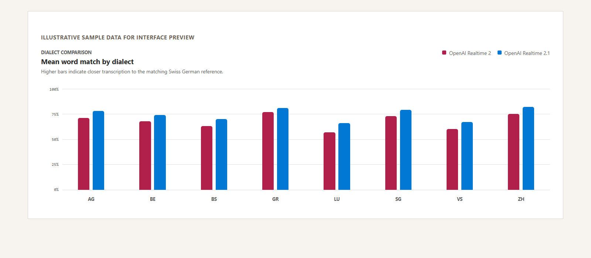
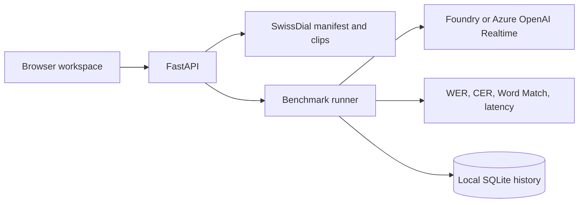

# Swiss German Transcription Benchmark

A local-first workbench for comparing how voice-capable models transcribe Swiss German dialects. Select ETH SwissDial utterances and model deployments, run a balanced evaluation matrix, inspect each transcript, and compare Word Match, WER, CER, and latency.


The browser workspace keeps utterances and their dialect references at the center of the workflow.



> The chart image uses illustrative sample values to demonstrate the interface. It does not report measured model performance.

The backend uses the Python [Microsoft Agent Framework](https://learn.microsoft.com/agent-framework/overview/agent-framework-overview) for Foundry-hosted audio models and a direct Azure OpenAI Realtime transport for the checked-in Realtime configurations. Audio, run history, cloud resources, and credentials are not included in the repository.

## What It Does

- Reads editable Microsoft Foundry deployment definitions from `config/models.json`.
- Imports a balanced sample from the official extracted ETH SwissDial 1.1 dataset into an ignored `data/swissdial` runtime directory. Legacy TSV ZIP exports remain supported.
- Streams each imported test clip locally in the browser beside its reference utterance.
- Lets evaluators choose any model-by-clip matrix and deployment-specific parameters.
- Runs a one-click Realtime 2 versus Realtime 2.1 comparison across every available dialect, using up to two utterances per dialect.
- Sends audio using Microsoft Agent Framework `Content.from_data(...)` through `FoundryChatClient`, adding the known dialect to each clip's transcription instruction.
- Scores model transcripts with normalized word error rate (WER) and character error rate (CER) against the matching Swiss German dialect transcript.
- Stores the complete local run history in `.runtime/benchmark.sqlite3`.
- Provides FastAPI endpoints, a dependency-free browser UI, VS Code debugger profiles, and a Foundry Toolkit Agent Inspector task.

## Architecture



## Repository Layout

```text
backend/app/       FastAPI API, runner, SQLite repository, Foundry adapter, metrics
backend/tests/     Offline unit and API tests
config/            Foundry deployment registry
data/swissdial/    Local manifest and clips after import (not committed)
frontend/          Static browser workbench served by FastAPI
scripts/           SwissDial archive importer
.vscode/           Run/debug/Agent Inspector configurations
```

## Prerequisites

- Python 3.11 or newer.
- A Microsoft Foundry project with one or more audio-capable model deployments.
- An Azure identity accepted by the target Foundry project. The app uses `DefaultAzureCredential`; configure your preferred local development credential before starting model runs. See the [Azure Identity guidance](https://learn.microsoft.com/azure/developer/python/sdk/authentication-overview).

The test bench uses **RBAC authentication only**. It does not read or require `AZURE_OPENAI_API_KEY`, `OPENAI_API_KEY`, or a Foundry key. Locally, `DefaultAzureCredential` uses the signed-in Azure CLI identity; when hosted, it should use the workload's managed identity. Grant that principal the appropriate Foundry/Azure OpenAI data-plane role before running a benchmark.

The repository does not include ETH SwissDial media. SwissDial 1.1 is licensed by ETH Zurich under [CC BY-NC 4.0](https://creativecommons.org/licenses/by-nc/4.0/). Confirm that your use is noncommercial and complies with its attribution and other terms before importing, running, publishing results, or sharing derived transcripts.

## Quick Start

1. Create and populate an isolated Python environment.

   ```powershell
   py -m venv .venv
   ./.venv/Scripts/python.exe -m pip install -r requirements.txt
   Copy-Item .env.example .env
   ```

2. Configure the endpoints used by your selected transport in `.env`:

  - Set `AZURE_OPENAI_ENDPOINT` for the checked-in Realtime models.
  - Set `FOUNDRY_PROJECT_ENDPOINT` for model entries that use the Microsoft Agent Framework adapter.

  Edit each `deployment` value in `config/models.json` so it exactly matches a deployment in your Azure resource. The checked-in registry contains Realtime 2 and Realtime 2.1 entries as configuration examples; it does not provision those deployments.

3. Import the extracted official SwissDial 1.1 directory. The default is a deterministic 16-clip sample balanced across all eight dialects.

   ```powershell
  ./.venv/Scripts/python.exe scripts/import_swissdial_archive.py "C:\path\to\data1.1"
   ```

  Use `--sample-size 20`, `--dialects be zh`, or `--seed 7` to change the bounded sample. A sample size of `0` imports every matching clip. The importer writes only the selected audio and `data/swissdial/manifest.jsonl`; both are ignored by Git. In the UI, choose all dialects or one dialect and select or resample 1-20 imported clips.

4. Start the API in one terminal.

   ```powershell
  ./.venv/Scripts/python.exe -m uvicorn backend.app.api:app --reload --port 8001
   ```

5. Open `http://127.0.0.1:8001` in a browser. FastAPI serves the benchmark UI and API from the same local origin, so no frontend build, npm installation, or CORS configuration is needed for normal local use.

## Configure Models

`config/models.json` is the intentionally small model registry. Each object has a stable UI ID, a human label, the literal Foundry deployment name, capability tags, and the parameter fields that this deployment accepts.

```json
{
  "id": "foundry-audio-preview",
  "label": "Audio preview deployment",
  "deployment": "your-foundry-deployment-name",
  "capabilities": ["audio", "transcription"],
  "parameters": [
    { "name": "temperature", "label": "Temperature", "kind": "number", "default": 0 }
  ]
}
```

The API rejects parameter names that are not listed for the selected model. Use a deterministic setting such as `temperature: 0` when comparing transcription quality.

### Saved instructions

The prompt editor can save a named instruction preset in the local SQLite database. Enter a name, choose **Save instruction**, then select that preset later to restore its text. Saving the same name updates the preset. Each benchmark still stores the exact instruction text that was active when the run started.

## Voice Catalog

`config/voice-options.json` is an informational inventory of realtime and managed voice options. Only deployments in `config/models.json` appear in the runnable model picker.

Entries with `"transport": "azure-openai-realtime"` decode source audio to 24 kHz PCM and use the Azure OpenAI Realtime WebSocket API with `DefaultAzureCredential`. Entries without that transport use the Microsoft Agent Framework `FoundryChatClient` adapter. Voice Live remains catalog metadata until a compatible stored-audio adapter is added.

## Dataset Manifest

The importer generates JSON Lines records like this:

```json
{
  "id": "be-1613",
  "audio_path": "clips/ch_be_1613.wav",
  "reference_transcript": "ja natürlech isch es internationals rennä ...",
  "source": "ETH SwissDial 1.1",
  "dialect": "BE",
  "dialect_name": "Bernese German",
  "standard_german_transcript": "ja natürlich ist ein internationales rennen ...",
  "language": "gsw"
}
```

`audio_path` is relative to the manifest. The official importer selects `ch_<dialect>` as the scoring reference and retains `de` only as metadata. You may supply a different manifest through `BENCHMARK_MANIFEST_PATH` as long as it uses the same minimal fields.

## Metrics and Results

Before scoring, text is Unicode-normalized, lowercased, stripped of punctuation, and whitespace-collapsed while preserving characters such as `ä`, `ö`, and `ü`. WER is token-level Levenshtein distance divided by reference word count; CER uses the same distance over normalized characters. A clip without a reference transcript receives no WER or CER rather than an invented score.

The UI also exposes **Word Match**, calculated as $\max(0, 1 - \text{WER})$. It gives a direct percentage where $100\%$ means the normalized word sequence exactly matched the reference. It is not a semantic similarity score: dialectal paraphrases or alternate spellings can still lower the value. Each row keeps the true reference utterance next to the actual model response so the score can be inspected in context.

Use **Compare all dialects** in the model panel to select both Realtime deployments and queue a balanced 32-test run over the default 16-utterance corpus. While results arrive, the run view groups mean Word Match by dialect in a vertical bar chart. Hover or focus a bar for the exact model, dialect, score, and scored utterance count.

The run-history overview aggregates all persisted runs into total runs, successful results versus all results, mean Match, and mean latency. Each individual history row includes its task completion ratio, Match, WER, mean latency, and a status-quality indicator. Indicators prioritize active/stopped/error states, then classify completed scored runs as **Strong match** ($\geq 85\%$), **Review** ($60\%-85\%$), or **Low match** ($< 60\%$).

Open a historical run to use **Download CSV** for its full settings and result matrix, or **Use run setup** to restore its available models, clips, parameters, and prompt into the configuration workspace for a follow-up run.

Every selected model and clip produces an independent result. A failed request is recorded with its error and latency, and does not stop the remainder of the matrix.

### Rate-limit resilience

Model invocations retry only transient rate-limit failures (`429`, throttling, or Too Many Requests). Each operation makes up to four attempts using exponential backoff starting at 0.75 seconds with bounded jitter; service-provided `Retry-After` or `Retry-After-Ms` guidance takes precedence. The retry delay is included in the result latency so throughput constraints remain observable in benchmark results.

## Run Controls

While a benchmark is active, the primary Run button is locked and the active-run panel shows completed tasks, percentage progress, and a progress bar. **Pause** waits for any in-flight clip to finish, then holds the remaining matrix. **Resume** continues from the next unfinished model/clip pair. **Stop** also lets the active clip finish, then marks the run `stopped` without scheduling the remaining pairs. Run state is stored in SQLite, so a paused run remains visible after a browser refresh; resuming it also starts a worker if the application was restarted.

## API Surface

| Endpoint | Purpose |
| --- | --- |
| `GET /api/health` | API, configuration, and dataset readiness |
| `GET /api/models` | Deployment registry and exposed parameter fields |
| `GET /api/instructions` | List named saved instruction presets |
| `POST /api/instructions` | Create or update a named instruction preset |
| `GET /api/dataset/items` | Import-discovered audio clips |
| `POST /api/runs` | Queue a model-by-clip benchmark matrix |
| `GET /api/runs` | List persisted runs |
| `GET /api/runs/summary` | Aggregate history metrics and fast-interpretation indicator |
| `GET /api/runs/{id}` | Retrieve results, transcripts, scores, and failures |
| `GET /api/runs/{id}/export.csv` | Download a complete run with settings, utterances, responses, metrics, and errors |

## Development and Debugging

Run all offline tests:

```powershell
./.venv/Scripts/python.exe -m unittest discover backend/tests -v
```

Use `Run Benchmark API` or `Debug Swiss German Benchmark API` from VS Code for normal API work. `Debug Agent Framework with Inspector` starts the Agent Framework debug bridge and opens Foundry Toolkit Agent Inspector on port `8088`; prompt and transcript content remain excluded from tracing unless `BENCHMARK_TRACE_ENABLED=true` and `BENCHMARK_TRACE_SENSITIVE_DATA=true` are both intentionally configured.

## Security and Data Handling

- Keep `.env`, ETH media, generated manifests, and `.runtime/` out of source control.
- Use Microsoft Entra RBAC for model access. API keys are intentionally not supported by the runner.
- Review the data path and retention policy of the Foundry deployment before uploading voice data.
- Do not enable sensitive tracing for production or restricted audio without an approved telemetry policy.
- Run benchmarks only against model deployments and projects you are authorized to use.

## License

This project is licensed under the [MIT License](LICENSE). Dataset licensing is independent and remains the responsibility of the dataset user.