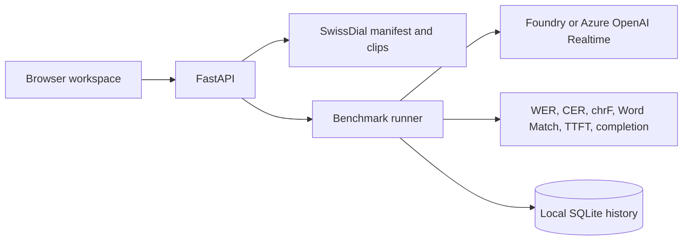

# Swiss German Transcription Benchmark

A local-first workbench for comparing how voice-capable models transcribe Swiss German dialects. Select ETH SwissDial utterances and model deployments, run a balanced evaluation matrix, inspect each transcript, and compare Word Match, WER, CER, streaming time to first token, and completion time.


The browser workspace keeps utterances and their dialect references at the center of the workflow.


> The chart image uses illustrative sample values to demonstrate the interface. It does not report measured model performance.

The backend uses the Python [Microsoft Agent Framework](https://learn.microsoft.com/agent-framework/overview/agent-framework-overview) for Foundry-hosted audio models and a direct Azure OpenAI Realtime transport for the checked-in Realtime configurations. Audio, run history, cloud resources, and credentials are not included in the repository.

## What It Does

- Reads editable Microsoft Foundry deployment definitions from `config/models.json`.
- Imports a balanced 160-clip catalog from the official extracted ETH SwissDial 1.1 dataset into an ignored `data/swissdial` runtime directory. Legacy TSV ZIP exports remain supported.
- Streams each imported test clip locally in the browser beside its Swiss German and High German reference text.
- Offers two tasks: **Transcribe dialect** (score against the matching Swiss German transcript) and **Translate to High German** (score against the High German parallel text).
- Offers four prompt strategies: **Baseline**, **Dialect-guided** (dialect features plus same-dialect example sentences), **Two-pass** (transcribe in dialect, then translate in the same session), and **Ensemble** (three independent Realtime passes reconciled by a text model such as gpt-5.5).
- Shows a **Dialects** page with estimated speaker numbers per dialect region from official Swiss Federal Statistical Office data, and weights results by those shares.
- Lets evaluators choose any model-by-clip matrix and deployment-specific parameters.
- Runs a one-click Realtime 2 versus Realtime 2.1 comparison across every available dialect, using up to two utterances per dialect.
- Sends audio using Microsoft Agent Framework `Content.from_data(...)` through `FoundryChatClient`, adding the known dialect to each clip's transcription instruction.
- Scores model output with normalized word error rate (WER), character error rate (CER), and chrF, and highlights word-level differences against the reference.
- Stores the complete local run history in `.runtime/benchmark.sqlite3`.
- Provides FastAPI endpoints, a dependency-free browser UI, VS Code debugger profiles, and a Foundry Toolkit Agent Inspector task.

## Architecture



## Repository Layout

```text
backend/app/       FastAPI API, runner, SQLite repository, Foundry adapter, metrics
backend/tests/     Offline unit and API tests
config/            Foundry deployment registry and dialect demographics/profiles (dialects.json)
data/swissdial/    Local manifest and clips after import (not committed)
frontend/          Static browser workbench served by FastAPI
scripts/           SwissDial archive importer
.vscode/           Run/debug/Agent Inspector configurations
```

## Prerequisites

- Python 3.11 or newer.
- A Microsoft Foundry project with one or more audio-capable model deployments.
- An Azure identity accepted by the target Foundry project. The app uses `DefaultAzureCredential`; configure your preferred local development credential before starting model runs. See the [Azure Identity guidance](https://learn.microsoft.com/azure/developer/python/sdk/authentication-overview).

The test bench uses **RBAC authentication only**. It does not read or require `AZURE_OPENAI_API_KEY`, `OPENAI_API_KEY`, or a Foundry key. Locally, `DefaultAzureCredential` uses the signed-in Azure CLI identity; when hosted, it should use the workload's managed identity. Grant that principal the appropriate Foundry/Azure OpenAI data-plane role before running a benchmark.

The repository does not include ETH SwissDial media. Download [SwissDial 1.1 from ETH Zurich](https://mtc.ethz.ch/publications/open-source/swiss-dial.html). The dataset is licensed under [CC BY-NC 4.0](https://creativecommons.org/licenses/by-nc/4.0/). Confirm that your use is noncommercial and complies with its attribution and other terms before importing, running, publishing results, or sharing derived transcripts.

## Quick Start

1. Create and populate an isolated Python environment.

   ```powershell
   py -m venv .venv
   ./.venv/Scripts/python.exe -m pip install -r requirements.txt
   Copy-Item .env.example .env
   ```

2. Configure the endpoints used by your selected transport in `.env`:

  - Set `AZURE_OPENAI_ENDPOINT` for the checked-in Realtime models.
  - Set `FOUNDRY_PROJECT_ENDPOINT` for model entries that use the Microsoft Agent Framework adapter.
  - Optionally set `BENCHMARK_REFINER_DEPLOYMENT` to a text deployment on the same Azure OpenAI resource (for example `gpt-5.5`) to enable the **Ensemble** strategy. `BENCHMARK_REFINER_REASONING_EFFORT` defaults to `low`; set it to an empty value for non-reasoning deployments.

  Edit each `deployment` value in `config/models.json` so it exactly matches a deployment in your Azure resource. The checked-in registry contains Realtime 2 and Realtime 2.1 entries as configuration examples; it does not provision those deployments.

3. Download and extract [SwissDial 1.1](https://mtc.ethz.ch/publications/open-source/swiss-dial.html), then import its directory. The default is a deterministic 160-clip catalog balanced across all eight dialects; the UI initially selects a 16-clip working sample from that catalog.

   ```powershell
  ./.venv/Scripts/python.exe scripts/import_swissdial_archive.py "C:\path\to\data1.1"
   ```

  Use `--catalog-size 320`, `--dialects be zh`, or `--seed 7` to change the local catalog. A catalog size of `0` imports every matching clip, which requires roughly 9.5 GB for SwissDial 1.1. The legacy `--sample-size` spelling remains an alias for `--catalog-size`. The importer writes only cataloged audio, `data/swissdial/manifest.jsonl`, and `data/swissdial/examples.jsonl`; all are ignored by Git. `examples.jsonl` holds text-only dialect/High German sentence pairs for prompting. It excludes every cataloged `sentence_id` (in all dialects, because SwissDial sentences are parallel) and any sentence whose High German text shares more than half of its content words with a cataloged sentence. To rebuild only the example pool for an existing catalog, for example from the text-only metadata download, run `import_swissdial_archive.py <dir-with-sentences_ch_de_numerics.json> --examples-only`. In the UI, choose all dialects or one dialect and select or resample up to the full imported catalog.

4. Start the API in one terminal.

   ```powershell
  ./.venv/Scripts/python.exe -m uvicorn backend.app.api:app --reload --port 8001
   ```

5. Open `http://127.0.0.1:8001` in a browser. FastAPI serves the benchmark UI and API from the same local origin, so no frontend build, npm installation, or CORS configuration is needed for normal local use.

## Configure Models

`config/models.json` is the intentionally small model registry. Each object has a stable UI ID, a human label, the literal Foundry deployment name, capability tags, and the parameter fields that this deployment accepts.

```json
{
  "id": "foundry-audio-preview",
  "label": "Audio preview deployment",
  "deployment": "your-foundry-deployment-name",
  "capabilities": ["audio", "transcription"],
  "parameters": [
    { "name": "temperature", "label": "Temperature", "kind": "number", "default": 0 }
  ]
}
```

The API rejects parameter names that are not listed for the selected model. Use a deterministic setting such as `temperature: 0` when comparing transcription quality.

### Saved instructions

The prompt editor can save a named instruction preset in the local SQLite database. Enter a name, choose **Save instruction**, then select that preset later to restore its text. Saving the same name updates the preset. Each benchmark still stores the exact instruction text that was active when the run started.

## Voice Catalog

`config/voice-options.json` is an informational inventory of realtime and managed voice options. Only deployments in `config/models.json` appear in the runnable model picker.

Entries with `"transport": "azure-openai-realtime"` decode source audio to 24 kHz PCM and use the Azure OpenAI Realtime WebSocket API with `DefaultAzureCredential`. Entries without that transport use the Microsoft Agent Framework `FoundryChatClient` adapter. Voice Live remains catalog metadata until a compatible stored-audio adapter is added.

## Dataset Manifest

The importer generates JSON Lines records like this:

```json
{
  "id": "be-1613",
  "audio_path": "clips/ch_be_1613.wav",
  "reference_transcript": "ja natürlech isch es internationals rennä ...",
  "source": "ETH SwissDial 1.1",
  "dialect": "BE",
  "dialect_name": "Bernese German",
  "standard_german_transcript": "ja natürlich ist ein internationales rennen ...",
  "language": "gsw"
}
```

`audio_path` is relative to the manifest. The official importer selects `ch_<dialect>` as the scoring reference and retains `de` only as metadata. You may supply a different manifest through `BENCHMARK_MANIFEST_PATH` as long as it uses the same minimal fields.

## Metrics and Results

Before scoring, text is Unicode-normalized, lowercased (which also folds `ß` to `ss`), stripped of punctuation, and whitespace-collapsed while preserving characters such as `ä`, `ö`, and `ü`. WER is token-level Levenshtein distance divided by reference word count; CER uses the same distance over normalized characters. A clip without a reference transcript receives no WER or CER rather than an invented score.

On the **Benchmark** tab, use the dialect chips to choose recordings from one dialect or all of them. Each chip shows the dialect region's share of Swiss German speakers and its clip count. Choose the task independently: **Transcribe dialect** scores against the matching Swiss German transcript, and **Translate to High German** scores against the High German parallel text. Switching the task also swaps the untouched default prompt; custom prompts remain unchanged. Runs persist the task and strategy and include both in CSV exports.

The UI also exposes **Word Match**, calculated as $\max(0, 1 - \text{WER})$. It gives a direct percentage where $100\%$ means the normalized word sequence exactly matched the reference. It is not a semantic similarity score: dialectal paraphrases or alternate spellings can still lower the value.

**chrF** is the character n-gram F-score (orders 1–6, $\beta = 2$) over normalized text with spaces removed. It gives partial credit for inflection and spelling variants ("spezielle" vs. "besondere" still shares characters with its context), so it is a better fit for translations than WER. It is computed on the fly from stored transcripts, so it is also available for older runs.

On the **Results** tab, each model gets a scorecard with mean match, a **speaker-weighted** match (per-dialect means weighted by each dialect region's share of Swiss German speakers; see below), chrF, and completion time. In the results table, words in the model output that are not in the reference are highlighted, and reference words the model missed are shown struck through. Filter the table by dialect or model, and sort by lowest or highest match to find failure patterns quickly. Two-pass runs also show the intermediate dialect transcript.

Use **Compare all dialects** in the model panel to select both Realtime deployments and queue a balanced 32-test run over the default 16-utterance corpus with the current task and strategy. While results arrive, the Results tab groups the active selected metric by dialect in a vertical bar chart ordered by number of speakers. When several numeric result fields are selected, switch the chart among Match, chrF, WER, CER, First token, and Completion. Hover or focus a bar for the exact model, dialect, value, and scored utterance count.

**First token** measures the time from sending the Realtime `response.create` event until the first non-empty streamed text delta of the final answer arrives (for two-pass runs this includes the dialect pass). It excludes local decoding, authentication, connection/session setup, and audio upload. **Completion** remains the full end-to-end duration from starting local processing through the complete transcript; it includes any rate-limit retry delay. First-token values are unavailable for adapters that return only a completed response and for runs created before this metric was added.

The same chart is shown for ordinary runs with a single selected model, including runs limited to one dialect.

The **History** tab aggregates all persisted runs into total runs, successful results versus all results, mean Match, and mean completion time. Each run row shows its models, task, strategy, status-quality indicator, mean match, and task completion ratio. Indicators prioritize active/stopped/error states, then classify completed scored runs as **Strong match** ($\geq 85\%$), **Review** ($60\%-85\%$), or **Low match** ($< 60\%$).

Open a historical run to use **Download CSV** for its full settings and result matrix, or **Use this setup** to restore its available models, clips, task, strategy, parameters, and prompt into the Benchmark tab for a follow-up run.

Every selected model and clip produces an independent result. A failed request is recorded with its error and completion time, and does not stop the remainder of the matrix.

## Prompt Strategies

| Strategy | What the model receives | Tasks |
| --- | --- | --- |
| **Baseline** | The base prompt plus the dialect name. This is the original behavior, so results stay comparable with older runs. | Both |
| **Dialect-guided** | The base prompt, the dialect's local name, characteristic features from `config/dialects.json`, four example sentences in the same dialect from the imported catalog, and (for High German) Swiss Standard German output rules such as always using `ss` and mapping narrative perfect tense to the preterite. | Both |
| **Two-pass** | First a dialect-guided verbatim transcription, then, in the same Realtime session (or as a follow-up Agent Framework turn), an instruction to translate that transcript into Swiss Standard German using the audio to resolve unclear words. | High German only |
| **Ensemble** | Three independent Realtime passes over the same clip (dialect-guided Swiss German, dialect-guided High German, and the baseline prompt), then one call to a text deployment that reconciles the hypotheses. For dialect output, the fusion prompt also includes eight retrieved same-dialect sentences from `examples.jsonl` so the result follows SwissDial spelling conventions. Needs `BENCHMARK_REFINER_DEPLOYMENT`. | Both |

Few-shot examples are chosen deterministically per clip and **never include the evaluated sentence**: the sentence itself and any clip with the same SwissDial `sentence_id` are excluded. Dialect feature lists use generic dialect vocabulary rather than catalog sentences, so they don't leak test content. The ensemble's retrieved spelling examples come from `examples.jsonl`, which is filtered the same way. The API default remains `baseline`; the UI defaults to **Dialect-guided**, which costs one Realtime call per clip, and marks **Ensemble** as the most accurate option when a fusion model is configured.

### Measured effect (September 2026)

All runs used OpenAI Realtime 2.1 on the full 160-clip catalog (20 clips per dialect). Each table compares only clips that every listed run completed. "Speaker-weighted" weights each dialect's mean by its share of Swiss German speakers (see [Dialect Importance](#dialect-importance)).

**Translate to High German** (149 paired clips; fusion model gpt-5.5 with low reasoning effort):

| Strategy | Word match | chrF | Speaker-weighted | AG | BE | BS | GR | LU | SG | VS | ZH |
| --- | ---: | ---: | ---: | ---: | ---: | ---: | ---: | ---: | ---: | ---: | ---: |
| Baseline | 67.1% | 77.5% | 68.5% | 60 | 72 | 64 | 75 | 62 | 74 | 57 | 72 |
| Dialect-guided | 69.9% | 78.6% | 71.9% | 51 | 77 | 76 | 78 | 68 | 76 | 59 | 77 |
| **Ensemble** | **72.8%** | **80.8%** | **73.8%** | 67 | 77 | 82 | 79 | 72 | 72 | 62 | 75 |

**Transcribe dialect** (148 paired clips):

| Strategy | Word match | chrF | Speaker-weighted | AG | BE | BS | GR | LU | SG | VS | ZH |
| --- | ---: | ---: | ---: | ---: | ---: | ---: | ---: | ---: | ---: | ---: | ---: |
| Baseline | 38.4% | 61.4% | 40.5% | 20 | 35 | 54 | 40 | 30 | 52 | 22 | 50 |
| Dialect-guided | 42.6% | 63.7% | 44.4% | 25 | 39 | 57 | 45 | 40 | 52 | 27 | 53 |
| **Ensemble** | **53.9%** | **70.8%** | **56.1%** | 36 | 46 | 66 | 54 | 56 | 66 | 37 | 65 |

- **Significance.** Ensemble vs. baseline is significant in both tasks (95% bootstrap CIs): High German +5.7 points word match [+2.2, +9.2] and +3.3 chrF; dialect transcription +15.5 points [+12.5, +18.6], with 102 wins against 15 losses. Guided vs. baseline for High German is +2.8 points [+0.2, +5.2].
- **Meaning, not just words.** Word match penalizes valid paraphrases. An LLM judge (gpt-5.5) rating whether each High German output preserves the reference meaning gives: baseline 47% fully preserved and 35% wrong; guided 48% and 36%; ensemble 54% and 28%. Guided mostly improves wording; the ensemble gets the meaning right more often.
- **Recognition is the bottleneck.** Having gpt-5.5 translate a Realtime dialect transcript, with or without retrieved example translations, did not beat the Realtime model's own translation (69.4% vs. 70.6%). Misheard words cannot be recovered downstream; combining independent hearings can outvote some of them. Fusing five or seven hearings instead of three added only about 1 point.
- **Where to expect errors.** Valais and Aargau remain hardest. Most of their remaining errors are misheard words, not translation mistakes. Bernese and Basel German are the most reliable.
- **Cost and speed.** The ensemble makes three Realtime calls and one text call per clip. On a capacity-1 Realtime deployment its median completion was 9 seconds per clip for High German and 20 seconds for dialect output, where the fusion prompt is longer and the run overlapped other experiments. Guided took about 3 seconds. Realtime outputs are not deterministic: the same prompt on the same clips can move a clip's score by about 15 points between runs, so compare strategies on at least 100 clips. In a smaller 45-clip run, **Two-pass** scored between baseline and guided while raising median completion time by about 65%.

## Dialect Importance

The **Dialects** tab estimates how many people speak each SwissDial dialect, so you can focus on the dialects that matter most. For each canton, it multiplies the permanent resident population (BFS STATPOP, 31 December 2025) by the share of residents naming German or Swiss German as a main language (BFS Structural Survey 2022, table T 01.08.01.02). Dialect regions group the cantons whose dialects are closest to each recording. For example, Lucerne German represents Central Switzerland (LU, ZG, SZ, UR, OW, NW), and St. Gallen German represents Eastern Switzerland (SG, TG, AR, AI). Dialect borders don't follow canton borders, so treat the figures as approximations.

| Dialect | Region | Est. speakers | Share of Swiss German speakers |
| --- | --- | ---: | ---: |
| Zurich German (ZH) | Canton of Zurich | 1.30M | 23.2% |
| Bernese German (BE) | German-speaking Bern | 0.89M | 15.9% |
| St. Gallen German (SG) | Eastern Switzerland | 0.81M | 14.4% |
| Lucerne German (LU) | Central Switzerland | 0.75M | 13.4% |
| Aargau German (AG) | Canton of Aargau | 0.63M | 11.3% |
| Basel German (BS) | Basel region (BS, BL) | 0.41M | 7.4% |
| Grisons German (GR) | German-speaking Grisons | 0.15M | 2.7% |
| Valais German (VS) | Upper Valais | 0.09M | 1.6% |

Together these regions cover about 90% of Switzerland's estimated 5.6 million German/Swiss German speakers. Solothurn, Schaffhausen, Glarus, and German speakers in bilingual and Latin cantons are not represented by a SwissDial dialect. The same data is available from `GET /api/dialects`, and the Results tab uses it for the speaker-weighted score. Edit `config/dialects.json` to update figures, regions, or dialect features.

### Rate-limit resilience

Model invocations retry only transient rate-limit failures (`429`, throttling, or Too Many Requests). Each operation makes up to six attempts using exponential backoff starting at 0.75 seconds (capped at 16 seconds, roughly 24 seconds of total waiting) with bounded jitter; service-provided `Retry-After` or `Retry-After-Ms` guidance takes precedence. The retry delay is included in the result completion time so throughput constraints remain observable in benchmark results.

## Run Controls

While a benchmark is active, the primary Run button is locked and the active-run panel shows completed tasks, percentage progress, and a progress bar. **Pause** waits for any in-flight clip to finish, then holds the remaining matrix. **Resume** continues from the next unfinished model/clip pair. **Stop** also lets the active clip finish, then marks the run `stopped` without scheduling the remaining pairs. Run state is stored in SQLite, so a paused run remains visible after a browser refresh; resuming it also starts a worker if the application was restarted.

## API Surface

| Endpoint | Purpose |
| --- | --- |
| `GET /api/health` | API, configuration, dataset readiness, and the configured fusion (`refiner_deployment`) model |
| `GET /api/models` | Deployment registry and exposed parameter fields |
| `GET /api/instructions` | List named saved instruction presets |
| `POST /api/instructions` | Create or update a named instruction preset |
| `GET /api/dataset/items` | Import-discovered audio clips |
| `GET /api/dialects` | Dialect profiles, canton demographics, and derived speaker estimates |
| `POST /api/runs` | Queue a model-by-clip matrix with `reference_mode` (`dialect` or `standard-german`) and `strategy` (`baseline`, `guided`, `two-pass`, or `ensemble`; default `baseline`) |
| `GET /api/runs` | List persisted runs |
| `GET /api/runs/summary` | Aggregate history metrics and fast-interpretation indicator |
| `GET /api/runs/{id}` | Retrieve results, transcripts, scores, and failures |
| `GET /api/runs/{id}/export.csv` | Download a complete run with settings, utterances, responses, metrics, and errors |

## Development and Debugging

Run all offline tests:

```powershell
./.venv/Scripts/python.exe -m unittest discover backend/tests -v
```

Use `Run Benchmark API` or `Debug Swiss German Benchmark API` from VS Code for normal API work. `Debug Agent Framework with Inspector` starts the Agent Framework debug bridge and opens Foundry Toolkit Agent Inspector on port `8088`; prompt and transcript content remain excluded from tracing unless `BENCHMARK_TRACE_ENABLED=true` and `BENCHMARK_TRACE_SENSITIVE_DATA=true` are both intentionally configured.

## Security and Data Handling

- Keep `.env`, ETH media, generated manifests, and `.runtime/` out of source control.
- Use Microsoft Entra RBAC for model access. API keys are intentionally not supported by the runner.
- Review the data path and retention policy of the Foundry deployment before uploading voice data.
- Do not enable sensitive tracing for production or restricted audio without an approved telemetry policy.
- Run benchmarks only against model deployments and projects you are authorized to use.

## License

This project is licensed under the [MIT License](LICENSE). Dataset licensing is independent and remains the responsibility of the dataset user.